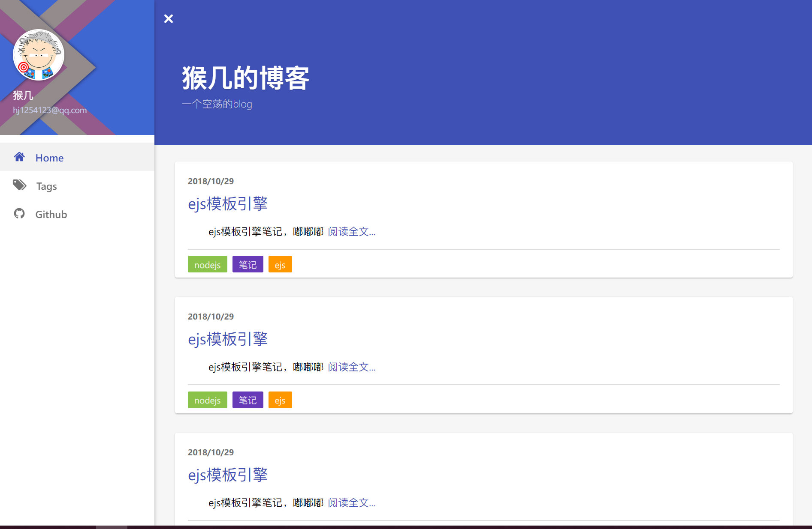
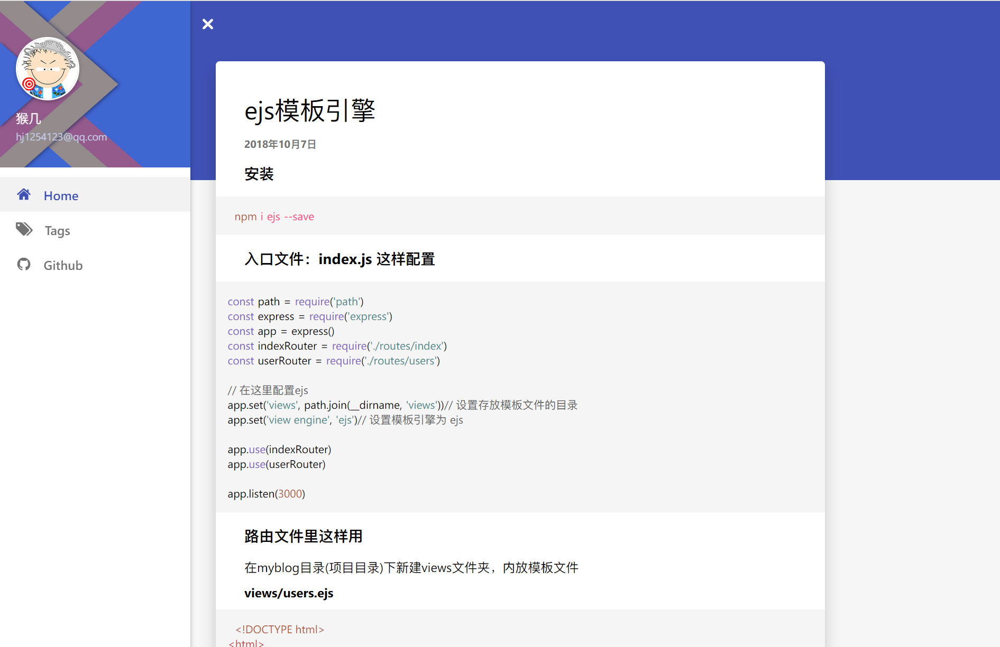
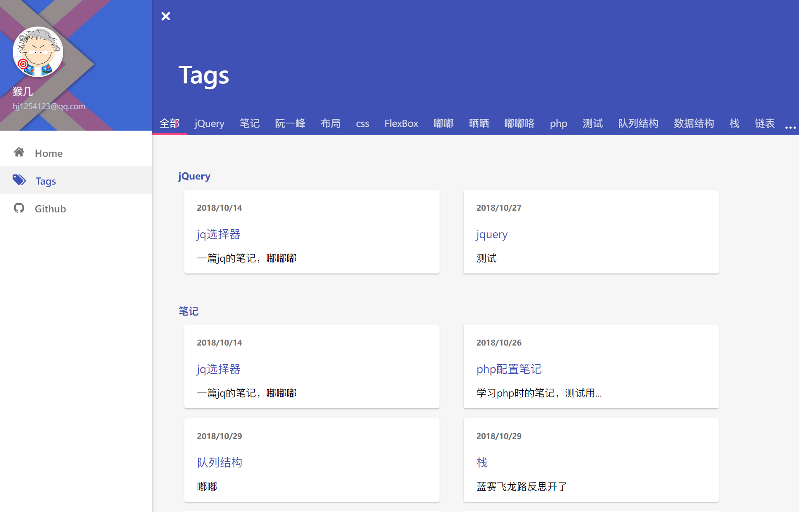
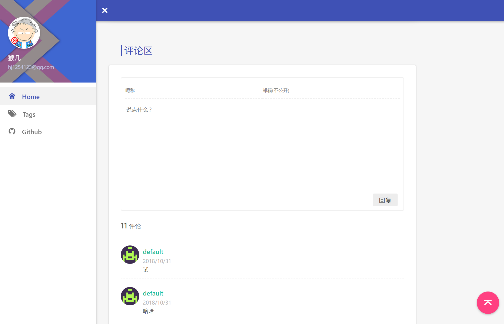
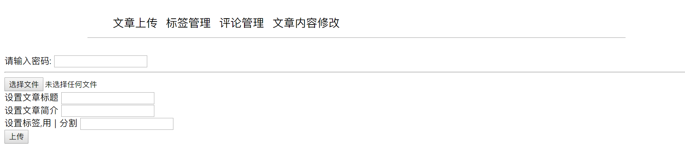

## NodeJS开发的博客程序

目的：

- 熟悉后端处理数据的方式

- 熟悉前后端分离，便于今后协同开发
- 锻炼JS代码能力
- 提高页面布局能力

## 启动

`npm i`

`node ./app.js`

## 实现功能

- 首页文章列表展示
- 标签功能，及标签页展示
- 文章详情页渲染，`markdown`支持
- 评论发布、删除功能
- 文章发布、删除、修改功能
- 标签添加、删除、修改功能
- 响应式适配移动端

## 截图

